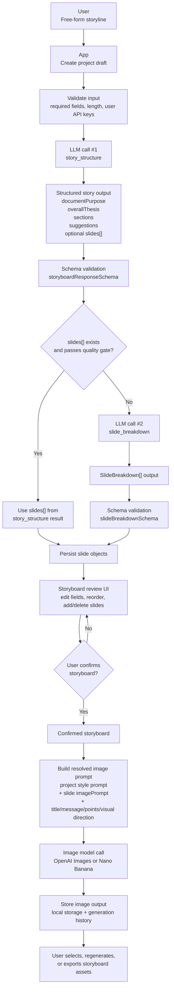
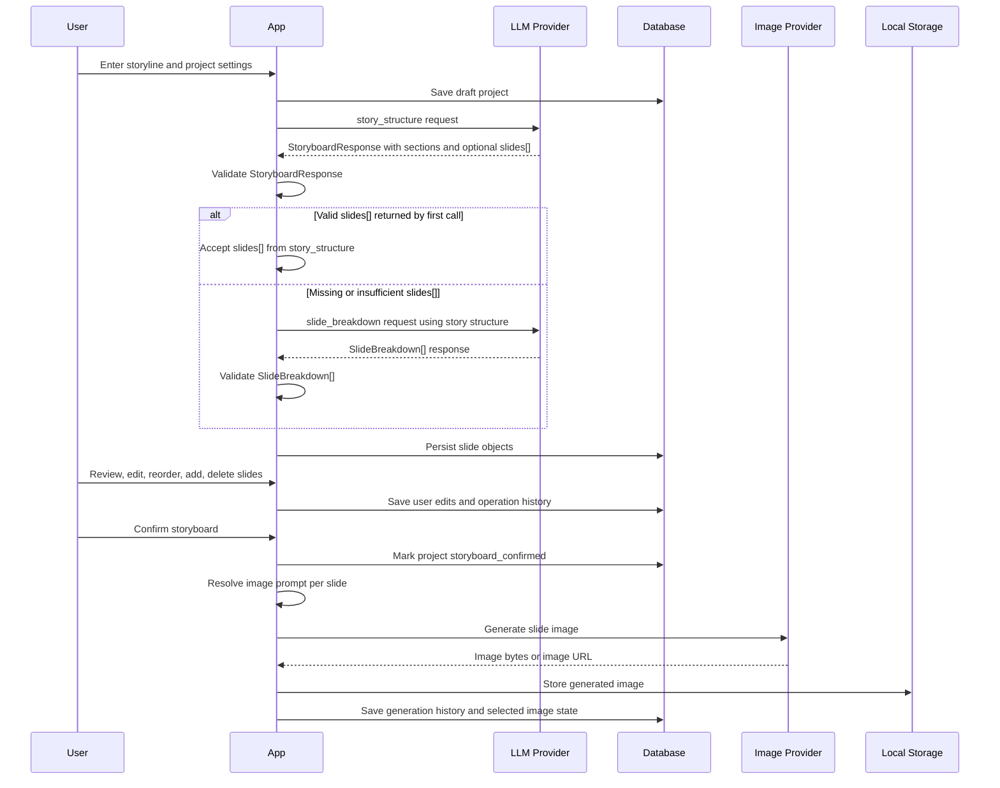

# Deck Storyboard

[한국어 README](README_KO.md)

Deck Storyboard turns a free-form proposal or report storyline into a reviewable slide storyboard, then uses confirmed slide content to generate reference slide images.

## Product Purpose

Deck Storyboard is for people who already have the rough storyline of a presentation, proposal, report, or consulting deck and need help turning that storyline into a clearer slide-by-slide structure.

It is not meant to produce a final, client-ready PowerPoint deck. The intended output is an early skeleton deck reference: a structured storyboard, slide titles, core messages, content points, visual directions, and optional reference images that can guide a human deck-building process.

> [!CAUTION]
> Deck Storyboard cannot create a finished deck. Its output is reference material only, intended to help humans draft and refine the final presentation.

Use it when you want to move from "I know the story I need to tell" to "I have a reviewable slide plan and visual references." The final layout, copy polish, client branding, and presentation craft remain human-owned.

The core product flow is:

1. A user enters a free-form storyline and project settings.
2. An LLM normalizes the storyline into a structured deck story.
3. The app creates or requests slide-level objects that match the storyboard schema.
4. The user reviews, edits, reorders, and confirms the storyboard.
5. The app combines project style settings and slide-level prompts.
6. An image generation provider creates reference images for each confirmed slide.

## Storyboard Object Contract

Each generated slide is represented by a structured object before it is persisted:

```ts
type SlideBreakdown = {
  sectionId: string;
  sectionTitle: string;
  title: string;
  coreMessage: string;
  contentPoints: string[];
  visualDirection: string;
  imagePrompt: string;
  slideRole: string;
};
```

The full storyboard response also includes the document-level structure:

```ts
type StoryboardResponse = {
  documentPurpose: string;
  overallThesis: string;
  sections: StorySection[];
  improvementSuggestions?: StoryImprovementSuggestion[];
  targetSlideCountRationale?: string;
  slides?: SlideBreakdown[];
};
```

The LLM never writes directly to the database. Its output is first validated against the structured schema. Only validated slide objects are persisted as slide records.

## LLM and Image Generation Workflow

The production-oriented design uses a hybrid LLM flow. It prefers a two-step path for messy real-world input, while allowing the second LLM call to be skipped when the first result already contains valid slide objects.



## Detailed Sequence



## Why Two LLM Steps Exist

Real user input is often less structured than a prepared slide canvas. It may be a long memo, rough bullets, a meeting transcript, or pasted notes. Splitting the reasoning into two possible LLM tasks improves control:

- `story_structure` focuses on understanding the deck purpose, audience, thesis, sections, gaps, and narrative flow.
- `slide_breakdown` focuses on producing complete slide objects with titles, messages, content points, visual direction, and image prompts.

The second call is not mandatory. If `story_structure` already returns valid, high-quality `slides[]`, the app can skip `slide_breakdown` and persist those slide objects directly.

Development mode seeds two local accounts when the app opens the database:

| Role | Login ID | Password |
|---|---|---|
| User | `test` | `test` |
| Admin placeholder | `admin` | `admin` |

The current auth schema is still email-based internally, so these short IDs map to `test@example.local` and `admin@example.local`. Full admin roles and the admin management screen are tracked separately in `IMPLEMENTATION_PLAN.md`.
