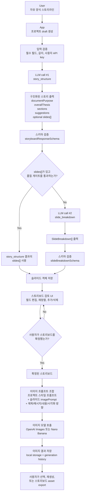
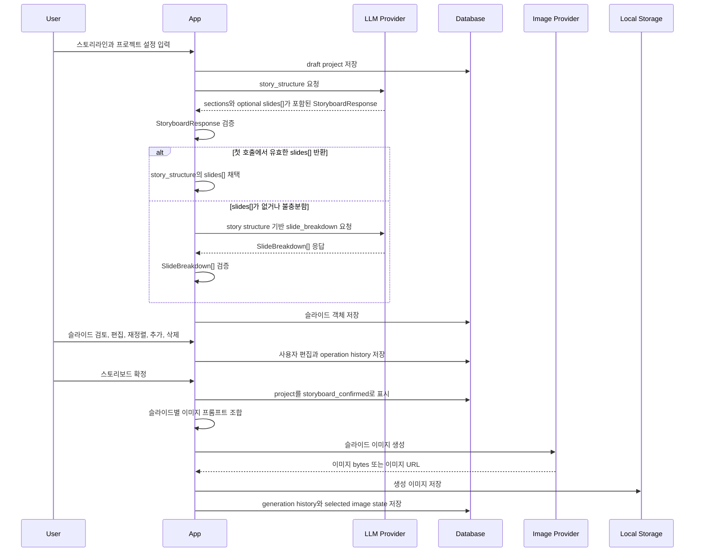

# Deck Storyboard

[English README](README.md)

Deck Storyboard는 자유 양식의 제안서 또는 리포트 스토리라인을 검토 가능한 슬라이드 스토리보드로 변환하고, 사용자가 확정한 슬라이드 내용을 바탕으로 참고용 슬라이드 이미지를 생성하는 앱입니다.

## 제품 목적

Deck Storyboard는 프리젠테이션, 제안서, 리포트, 컨설팅 덱의 전체 스토리라인을 이미 어느 정도 가지고 있는 사람을 위한 도구입니다. 목표는 그 스토리라인을 더 명확한 슬라이드 단위 구조로 나누고, 검토 가능한 초기 스토리보드로 만드는 것입니다.

이 앱은 최종 납품용 PowerPoint 덱을 자동 생성하기 위한 도구가 아닙니다. 의도한 산출물은 초기 skeleton deck 참고자료입니다. 즉, 구조화된 스토리보드, 슬라이드 제목, 핵심 메시지, 내용 포인트, 시각화 방향, 선택적인 참고 이미지를 제공해 사람이 최종 덱을 만드는 과정을 돕습니다.

> [!CAUTION]
> Deck Storyboard는 완성 deck을 만들 수 없습니다. 산출물은 어디까지나 사람이 최종 프리젠테이션을 만들 때 참고하는 초기 skeleton deck 자료입니다.

"어떤 이야기를 해야 하는지는 알고 있지만, 이를 어떤 슬라이드 흐름으로 정리할지 잡고 싶다"는 상황에 적합합니다. 최종 레이아웃, 문장 다듬기, 클라이언트 브랜드 반영, 발표용 완성도는 여전히 사람이 책임지는 영역입니다.

핵심 제품 흐름은 다음과 같습니다.

1. 사용자가 자유 양식 스토리라인과 프로젝트 설정을 입력합니다.
2. LLM이 스토리라인을 구조화된 덱 스토리로 정규화합니다.
3. 앱이 스토리보드 스키마에 맞는 슬라이드 단위 객체를 생성하거나 LLM에 요청합니다.
4. 사용자가 스토리보드를 검토, 편집, 재정렬, 확정합니다.
5. 앱이 프로젝트 스타일 설정과 슬라이드별 프롬프트를 결합합니다.
6. 이미지 생성 provider가 확정된 각 슬라이드의 참고 이미지를 생성합니다.

## 스토리보드 객체 계약

각 생성 슬라이드는 DB에 저장되기 전에 구조화된 객체로 표현됩니다.

```ts
type SlideBreakdown = {
  sectionId: string;
  sectionTitle: string;
  title: string;
  coreMessage: string;
  contentPoints: string[];
  visualDirection: string;
  imagePrompt: string;
  slideRole: string;
};
```

전체 스토리보드 응답에는 문서 단위 구조도 함께 포함됩니다.

```ts
type StoryboardResponse = {
  documentPurpose: string;
  overallThesis: string;
  sections: StorySection[];
  improvementSuggestions?: StoryImprovementSuggestion[];
  targetSlideCountRationale?: string;
  slides?: SlideBreakdown[];
};
```

LLM은 DB에 직접 쓰지 않습니다. LLM 출력은 먼저 구조화된 스키마로 검증되고, 검증을 통과한 슬라이드 객체만 slide record로 저장됩니다.

## LLM 및 이미지 생성 워크플로우

실제 제품 설계는 hybrid LLM 흐름을 사용합니다. 현실적인 사용자 입력이 정돈되어 있지 않을 가능성을 감안해 기본적으로 2단계 흐름을 선호하되, 첫 번째 LLM 결과에 이미 유효한 슬라이드 객체가 포함되어 있으면 두 번째 LLM 호출을 생략할 수 있습니다.



## 상세 시퀀스



## LLM 호출이 두 단계인 이유

실제 사용자 입력은 준비된 슬라이드 캔버스처럼 구조화되어 있지 않은 경우가 많습니다. 긴 메모, 거친 bullet, 회의록, 복사해 붙인 노트일 수 있습니다. 그래서 추론을 두 개의 LLM task로 나누면 제어하기가 쉽습니다.

- `story_structure`는 덱의 목적, 청중, 핵심 논지, 섹션, 누락된 내용, 내러티브 흐름을 이해하는 데 집중합니다.
- `slide_breakdown`은 제목, 메시지, 내용 bullet, 시각화 방향, 이미지 프롬프트를 포함한 완성된 슬라이드 객체를 만드는 데 집중합니다.

두 번째 호출은 필수가 아닙니다. `story_structure`가 이미 유효하고 품질 기준을 통과하는 `slides[]`를 반환하면, 앱은 `slide_breakdown`을 생략하고 해당 슬라이드 객체를 바로 저장할 수 있습니다.

development 모드에서는 앱이 DB를 열 때 로컬 계정 두 개를 seed합니다.

| 역할 | 로그인 ID | 비밀번호 |
|---|---|---|
| 일반 회원 | `test` | `test` |
| 관리자 placeholder | `admin` | `admin` |

현재 auth schema는 내부적으로 아직 email 기반이므로 이 짧은 ID들은 각각 `test@example.local`, `admin@example.local`로 매핑됩니다. 실제 admin role과 관리자 관리 화면은 `IMPLEMENTATION_PLAN.md`에서 별도 MVP task로 추적합니다.
